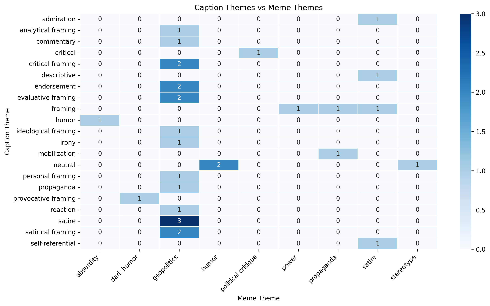

# war-memes-computational-anthropology 
_First project in a digital/computational anthropology series_

This project adopts an experimental anthropological approach to digital data, using computational methods to explore patterns in social media and meme-based communication.

To understand how digital practices operate during times of crisis, looking at memes is like looking into an area that seems small on the surface but actually contains vast layers of meaning. At first glance, this dataset might seem to confirm a simple idea: people react to crises. But closer inspection reveals a far more complex understanding of the production process.

The first thing that stands out about these memes is the absence of a singular and dominant interpretive framework. The content is critical, neutral, and not bound to a specific ideological framework. However, different approaches and tones converge. This suggests that users make sense of a geopolitical crisis not from a single narrative, but from multiple and fragmented interpretations. Therefore, it is not a question of “are people negative or positive?”, but rather a problem of the multiplication and dispersion of meaning. In this case, there is an interpretive division rather than an emotional one.

As a result of this fragmentation, memes become a space for negotiation rather than agreement. Instead of canceling each other out, different forms of interpretation—neutral transmission, open criticism, and ironic distance—circulate within the same digital space. This shows that memes, rather than conveying a fixed message, demonstrate a constant re-creation and redistribution of meaning.

A second important finding is that these memes are adapted to geopolitical conditions. In digital practices, humor, especially in the form of memes, is considered an escape route for users. The distinguishing characteristics of such content are often tendencies toward absurdity, personal attacks, or decontextualization. However, the opposite is true here. Instead of escaping the subject, the humor constantly returns to it. The content continues to focus on themes of power relations, state actors, and conflict.

This shows that users utilize memes not as an escape mechanism, but as a tool for processing and reinterpreting. Even if joked about, exaggerated, or ironized, the subject is never abandoned. However, each humorous transformation emerges as a new version of the same geopolitical narrative. Thus, memes become practices that reconstruct reality from different perspectives, rather than escaping it.

Digital humor, in this context, can be considered a form of meaning production, not merely superficial entertainment. The user, instead of fleeing from the crisis, engages with it—not by directly constructing a serious, coherent narrative, but by deconstructing, reassembling, and circulating it. This once again demonstrates that meaning in digital practices is plural and dynamic.

In this dataset, memes are not a result of war or geopolitical tension. On the contrary, they are a tool for reflecting on it, analyzing it, and reinterpreting it. People are laughing, but they are still talking about the same issue.

## Data
The dataset consists of 35 manually collected memes related to the 2026 Iran–United States conflict. Each entry includes:
- Post caption (text)
- Meme text (if present)
- Caption theme (coded)
- Meme theme (coded)
- Image description
- Source link

The data was manually annotated to capture both explicit and implicit thematic elements.

## Method
This project uses a qualitative and exploratory approach.

- Themes were coded manually based on interpretive categories such as:
  - framing
  - critical
  - neutral
  - satire
  - ideological
- Multi-label entries were simplified by extracting the dominant theme
- A cross-tabulation was created to examine relationships between caption themes and meme themes

This approach focuses on meaning production rather than statistical generalization.

## Visualization
To explore patterns in the dataset, a heatmap was generated showing the relationship between caption themes and meme themes.

The visualization highlights:
- The concentration of geopolitical framing
- The overlap between satire and political critique
- The absence of a single dominant interpretive pattern

## Key Findings
- There is no single dominant narrative; interpretations are fragmented
- Memes function as spaces of negotiation rather than agreement
- Humor does not act as an escape, but repeatedly returns to geopolitical content
- Meaning is continuously reconstructed through irony, critique, and repetition

## Project Scope
This is the first project in an ongoing series exploring digital practices during moments of crisis.

## Author
Elif Hazal Gougler  
Media/Digital Anthropology Phd Student
